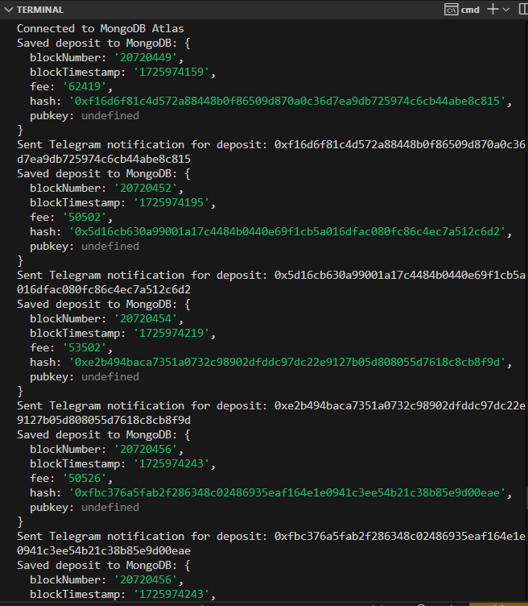
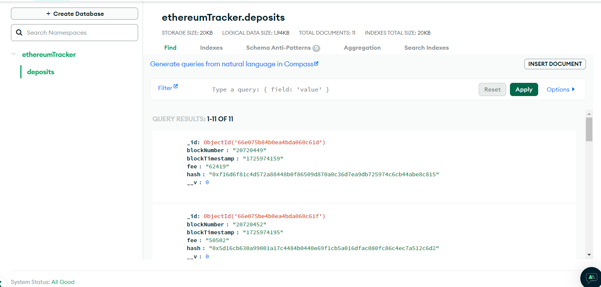
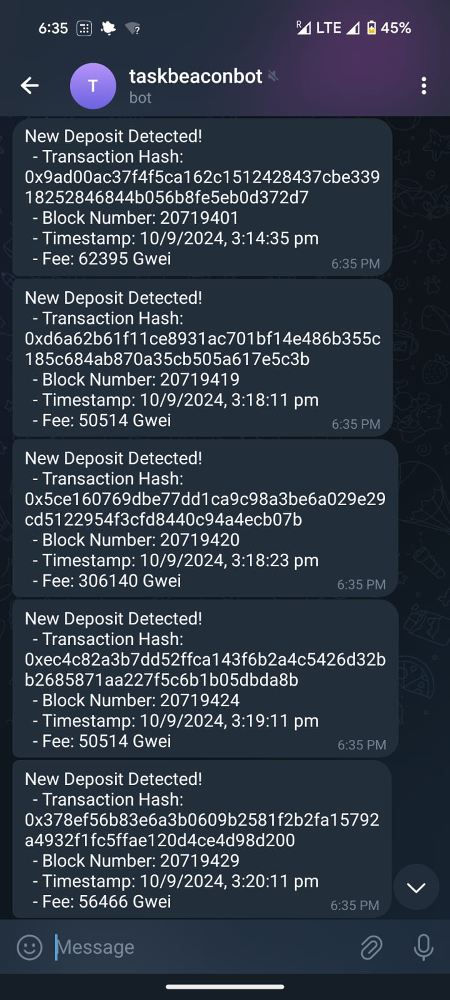

# Ethereum Deposit Tracker

## Objective
The **Ethereum Deposit Tracker** monitors and records ETH deposits on the Beacon Deposit Contract in real-time, storing the details in MongoDB, and sending notifications via Telegram.

## Project Structure
ethereum-deposit-tracker-backend/ 
├── node_modules/ 
├── .env 
├── package-lock.json 
├── package.json 
├── script-al.js 
├── telegram-bot.js 
└── tracker.js


## Prerequisites

Before setting up, ensure you have the following:

- [Node.js](https://nodejs.org/) (v14+)
- MongoDB Atlas or Local MongoDB instance
- Alchemy API Key for Ethereum blockchain interactions
- Telegram Bot API Token and Chat ID

## Installation


### Step 1: Clone the repository
```bash
git clone <repository-url>
cd ethereum-deposit-tracker-backend
```


### Step 2: Install Dependencies
```bash
npm install
```


### Step 3: Configure Environment Variables
Create a .env file in the root of the project and add the following:

```bash
RPC_URL=your-alchemy-rpc-url
TELEGRAM_BOT_TOKEN=your-telegram-bot-token
TELEGRAM_CHAT_ID=your-telegram-chat-id
MONGODB_URI=your-mongodb-uri
```
Replace the placeholders with your actual credentials.


Usage Instructions
Step 1: Start MongoDB Connection
The application connects to the specified MongoDB instance to store deposit data. This is there to allow any form of visualisation with connection to frontend in the future. the data can be extracted from the database for graph visualisation on web.

In tracker.js, the MongoDB connection is initialized using:
```javascript
mongoose.connect(process.env.MONGODB_URI, { useNewUrlParser: true, useUnifiedTopology: true });
```

Step 2: Track Ethereum Deposits
The tracker.js script monitors the Beacon Deposit Contract for new deposits. When a new deposit is detected, it:

Fetches the deposit transaction using Ethereum RPC methods.
Extracts relevant information (e.g., block number, timestamp, fee, hash, public key).
Saves the deposit data in MongoDB.
Sends a Telegram notification with the deposit details.
To start tracking, run:

```bash
node tracker.js
```

Step 3: Telegram Notifications
The application sends notifications for each new deposit via a Telegram bot. The bot uses telegram-bot.js to send deposit details to the specified chat.


Using Alchemy key:
The script-al.js file demonstrates how to interact with Alchemy's SDK to fetch specific Ethereum blocks.

To test:
```bash
node script-al.js
```


Example Usage:

Detected a Deposit

Transaction Hash: 0x1391be19259f10e01336a383217cf35344dd7aa157e95030f46235448ef5e5d6
Block Number: 15221026
Timestamp: 2024-09-10 12:34:56
Fee: 21000 Gwei
Public Key: 0x04c9e5...


Console:



Saved to MongoDB
```json
{
  "blockNumber": "15221026",
  "blockTimestamp": "2024-09-10T12:34:56Z",
  "fee": "21000",
  "hash": "0x1391be19259f10e01336a383217cf35344dd7aa157e95030f46235448ef5e5d6",
  "pubkey": "0x04c9e5..."
}
```
MongoDB Atlas Page:



Telegram Notification A message like the following is sent to the configured Telegram chat:

```yaml
New Deposit Detected!
- Transaction Hash: 0x1391be19259f10e01336a383217cf35344dd7aa157e95030f46235448ef5e5d6
- Block Number: 15221026
- Timestamp: 2024-09-10 12:34:56
- Fee: 21000 Gwei
```
Telegram Notifications

